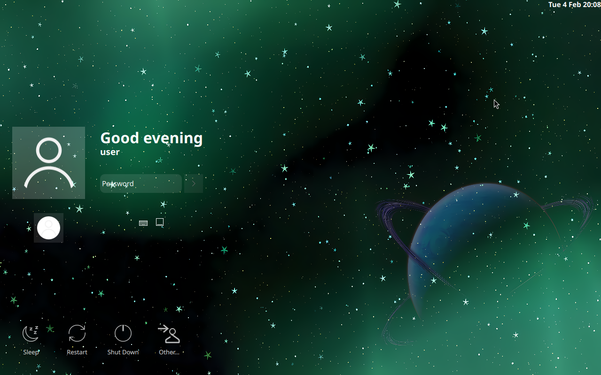

# Space KDE
This is a modification of the default Space SDDM theme for Vincent OS Login screen.

Modifications including:
- Removing the blur on the background image
- Put users icon in square instead of circle

## License
This project is licensed under the GNU Lesser General Public License v2.1 - see the [LICENSE](LICENSE) file for details.

## Credits
This project is a fork of the original [Space SDDM theme](https://github.com/EliverLara/Space-kde) by EliverLara.
